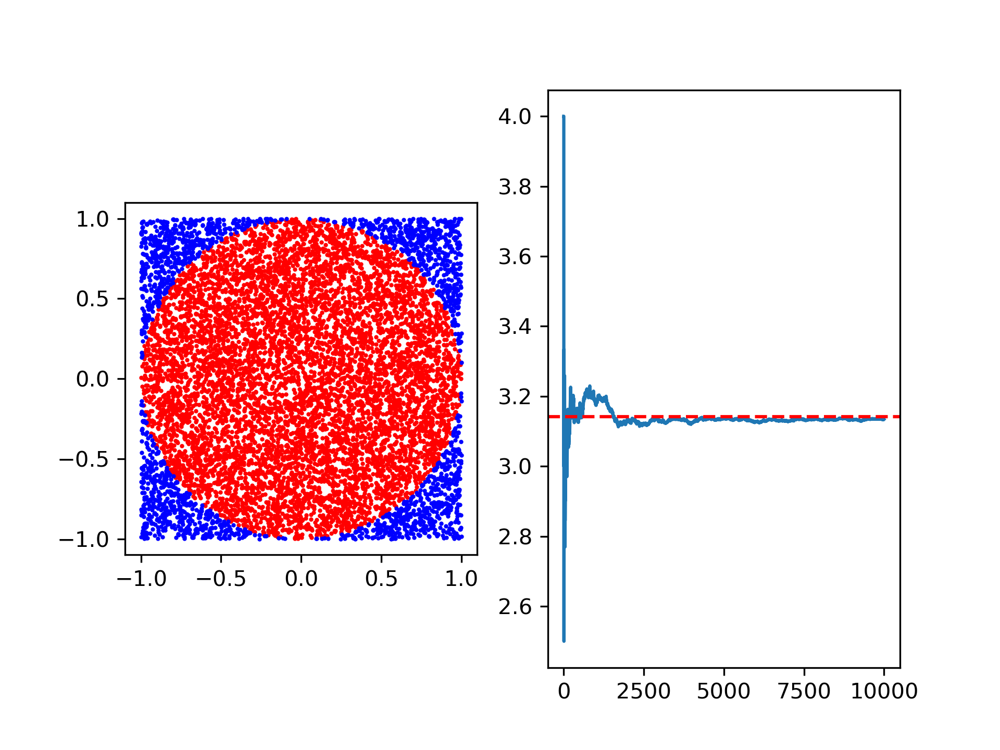

# Monte Carlo pi estimation

## Overview 

This project estimates a value of pi through a geometric method. This project demonstrates Monte Carlo simulations, vectorisation using NumPy, and Matplotlib plotting.

## Theory

To find an estimation for pi the simulation generates N points in a 2x2 square, by randomly picking x and y values between -1 and 1. We can then incscribe a circle of radius 1 centred at the origin onto this plot. As the area of this circle is given  pi*r^2, and the area of the square is 4*r^2, we find that the proportion of points in the circle provides an estimation for pi/4.

## Results

This plot highlights the key process and results in the simulation. The left side shows the location of all the randomly generated points, and the right the convergence of the results towards the true value of pi, as the number of points increases.

